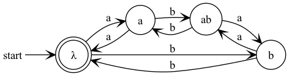
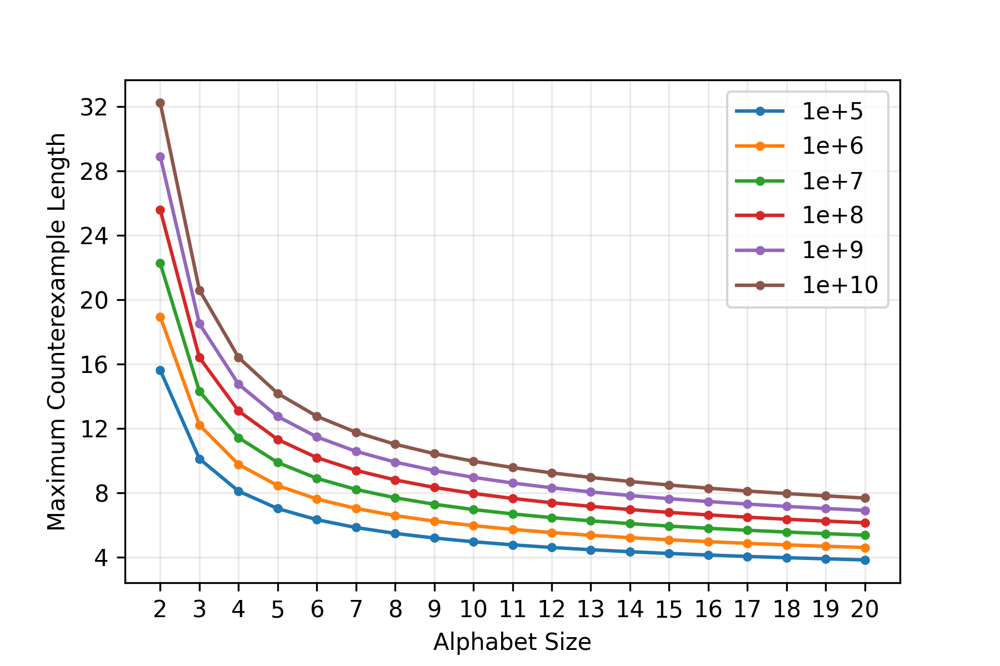
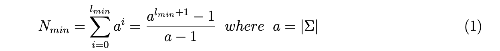

## Overview 

Python Implementation of the _L_* algorithm by [Angluin (1987)](https://people.eecs.berkeley.edu/~dawnsong/teaching/s10/papers/angluin87.pdf): <i>Learning Regular Sets from Queries and Counterexamples</i>. During learning, the _L_* algorithm only has access to two external resources: the alphabet Σ of an unknown regular language _L_* and a teacher _T_ capable of answering two types of queries. One is the _membership query_ regarding whether a given string _w_ belongs to _L_*. The other is the _equivalence query_ regarding whether a proposed DFA accepts _L_. If T rejects the proposed DFA, it returns a counterexample to the learner to refine its proposal.

The implementation here, however, only assumes a black box teacher _T_ that can only answer membership queries. As a result, _T_ can be any arbitrary function that takes a string as input and returns True if the string is accepted by the target language or False otherwise. Counterexamples are found through exhaustive search within a finite length range. The search length range starts with 2, because strings of lengths 0 and 1 are already queried. It ends with maximum counterexample length, either given by the user, or calculated from the maximum number of counterexample searches, whichever shorter.


## Lstar

The _L_* algorithm is implemented in the `Lstar.py` file, which also contains a class method for constructing the observation table that can convert to a DFA when it is consistent and closed. The learning procedure of the _L_* algorithm is implemented by the function called `lstar` inside the same file. The usage is as follows.


```python3
> from Lstar import lstar
# a teacher recognizes the language containing "ababbaa" and "bbbaaa" substrings
> def T(w): return "ababbaa" in w and "bbbaaa" in w
> alphabet = "ab"
# by default, max_ce_len=None, and max_ce_searches=1e+5
> table = lstar(alphabet, T, max_ce_len=None, max_ce_searches=1e+5)
> print(table.dfa) # print the contents of the DFA, but this may be a lot!
> table.dfa.visualize("ababbaa->bbbaaa", format="png") # visualize the DFA and save it as "ababbaa->bbbaaa.png". 
```

 

The visualization of the example code above is shown below:

bbbaaa.png">


## DFA

The implementation also comes with a simple class method for building a DFA. The usage is illustrated below.

```python3
> from DFA import DFA
> alphabet = "ab"
> init_state = "λ"
> final_states = ["λ"]
> states = set(["λ", "a", "b", "ab"])
# {current state: {input symbol: next state, ...}, ...}
> delta = {"λ": {"a": "a", "b": "b"},  
           "a": {"a": "λ", "b": "ab"}, 
           "b": {"a": "ab", "b": "λ"}, 
           "ab": {"a": "b", "b": "a"},}
> dfa = DFA(alphabet, init_state, final_states, states, delta)
```


Once a DFA is initialized, you can use it to recognize a string or visualize the DFA.  

```python3
> dfa.recognize("ababa") # check the membership of a string => False
> dfa.visualize("even_a_even_b", format="png") # visualize the dfa. By default, format="pdf"
```



## Suggestions

Since the search for counterexamples is done exhaustively and bound by a maximum counterexample length, that means that the current implementation can infer the right DFA when the minimum length of the true counterexample(s) exceeds the maximum counterexample length, either given or estimated. To understand this more vividly, the following plot shows the maximum counterexample length searchable when the alphabet size and the maximum number of searches vary.




**Rule of thumb**: 

- If you know the minimum number of states for the target DFA or the minimum length of the longest counterexample, please set `max_ce_len` accordingly when using `lstar` function. In this case, also calculate the maximum number of searches needed using the Eq. (1) and put a larger number to `max_ce_searches` (which only defaults to 1e+5), such that the algorithm will reach the maximum counterexample len as desired. Or simply put a unrealistically large number to `max_ce_searches`. The algorithm will always choose the shorter maximum counterexample length to search. 



- In case you have no information regarding the minimum number of states for the target DFA, just do some trials and errors. Start with a small `max_ce_searches`, and increase it gradually. Alternatively, you can also set `max_ce_searches` to an extremely large number and increase the `max_ce_len` incrementally. Since the number of searches is a exponential function of the `max_ce_len` with the alphabet size as its base, so maybe the former approach is better!
